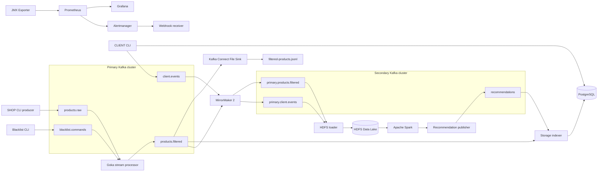

# Аналитическая платформа маркетплейса

Итоговый проект курса по Apache Kafka. Решение эмулирует источники данных
маркетплейса, фильтрует запрещённые товары, сохраняет разрешённые данные,
зеркалирует их во второй Kafka-кластер и выполняет пакетную аналитику в
HDFS/Spark.

## Архитектура



Оба Kafka-кластера состоят из трёх брокеров. Все Kafka listeners используют
`SASL_SSL`: TLS шифрует соединение, SASL/PLAIN аутентифицирует сервисы, а ACL
ограничивают доступ к топикам и consumer groups.

## Компоненты

- Primary Kafka - приём данных SHOP/CLIENT и потоковая обработка.
- Secondary Kafka - резервная копия данных и источник для аналитики.
- MirrorMaker 2 - одностороннее зеркалирование из primary в secondary.
- Goka - фильтрация товаров по управляемому списку запретов.
- Kafka Connect - запись разрешённых товаров в JSON Lines файл.
- PostgreSQL - поиск товаров, хранение запросов и рекомендаций.
- HDFS - Data Lake с коэффициентом репликации 3.
- Spark - пакетный расчёт рекомендаций.
- JMX Exporter, Prometheus, Grafana, Alertmanager и webhook receiver - мониторинг Kafka и доставка алертов.
- AKHQ - просмотр обоих Kafka-кластеров.

## Структура проекта

```text
final_project/
├── certs/                         # CA, Keystore и Truststore шести брокеров
├── cmd/
│   ├── client/                    # CLIENT CLI
│   ├── hdfs-loader/               # Kafka -> HDFS
│   ├── recommendation-publisher/  # HDFS -> Kafka
│   ├── shop-producer/             # файл -> Kafka
│   ├── storage-indexer/           # Kafka -> PostgreSQL
│   └── stream-processor/          # Goka-фильтр и blacklist CLI
├── config/
│   ├── alertmanager/
│   ├── client/
│   ├── grafana/
│   ├── jaas/
│   ├── jmx/
│   ├── kafka/                     # отдельный server.properties каждого брокера
│   ├── kafka-connect/
│   ├── mm2/
│   └── prometheus/
├── data/
│   ├── blacklist.json
│   └── products.jsonl
├── hadoop/
├── internal/
├── kafka-connect/plugins/
├── postgres/init.sql
├── scripts/
├── spark/jobs/recommendations.py
├── docker-compose.yaml
└── Makefile
```

## Топики

| Кластер | Топик | Назначение |
|---|---|---|
| primary | `products.raw` | Исходные товары от SHOP producer |
| primary | `blacklist.commands` | Команды управления списком запретов |
| primary | `product-filter-table` | Компактированное состояние Goka |
| primary | `products.filtered` | Разрешённые товары |
| primary | `client.events` | Запросы CLIENT CLI для аналитики |
| secondary | `primary.products.filtered` | Зеркало разрешённых товаров |
| secondary | `primary.client.events` | Зеркало клиентских событий |
| secondary | `recommendations` | Результаты Spark-аналитики |

Все пользовательские топики имеют три партиции, replication factor 3 и
`min.insync.replicas=2`. Автоматическое создание топиков отключено.

## Учётные записи и ACL

| Пользователь | Доступ |
|---|---|
| `admin` | Единственный Kafka super user, используется для администрирования |
| `shop` | Запись только в `products.raw` |
| `client` | Запись в `client.events`, чтение `recommendations` |
| `processor` | Чтение raw/blacklist, запись filtered и Goka table |
| `connect` | Чтение filtered и работа со служебными топиками Connect |
| `storage` | Чтение filtered/recommendations |
| `analytics` | Чтение зеркальных топиков, запись recommendations |
| `mirror` | Репликация между кластерами и служебные MM2-топики |

Учебные пароли находятся в JAAS и Compose. Они предназначены только для
локального стенда и не должны использоваться в production.

## Требования

- Docker Desktop или Docker Engine с Docker Compose v2.
- Не менее 10-12 ГБ памяти для одновременного запуска полного стенда.
- OpenSSL и Java `keytool`, только если нужно пересоздать сертификаты.
- Go 1.25+ для запуска тестов вне Docker.

Hadoop-контейнеры используют платформу `linux/amd64`. На Apple Silicon они
работают через эмуляцию и запускаются дольше остальных компонентов.

## Запуск основного контура

Сертификаты уже находятся в репозитории. При необходимости их можно создать
заново:

```bash
make certs
```

После пересоздания сертификатов рекомендуется удалить старые контейнеры и
volumes:

```bash
docker compose --profile analytics --profile tools down -v
```

Запустите основной контур:

```bash
docker compose up -d --build
docker compose ps
```

Сервис `kafka-init` ожидает готовности всех брокеров, создаёт топики и
назначает ACL. Успешное завершение можно проверить командой:

```bash
docker compose ps -a kafka-init
```

## Проверка основного потока

Скрипт загружает blacklist, отправляет пять товаров, проверяет фильтрацию,
PostgreSQL, Kafka Connect и зеркалирование:

```bash
./scripts/test-e2e.sh
```

Ожидаемый результат:

- четыре разрешённых товара находятся в PostgreSQL;
- товар `99999` отсутствует в PostgreSQL и выходном файле Connect;
- не менее четырёх сообщений находятся в `primary.products.filtered` второго
  кластера;
- CLIENT CLI возвращает результат поиска по слову `часы`.

## SHOP API

SHOP API эмулируется CLI-продюсером. Он читает версионируемый файл
`data/products.jsonl`, валидирует записи и отправляет их в `products.raw` с
ключом `product_id`:

```bash
docker compose --profile tools run --no-deps --rm shop-producer
```

Можно передать другой файл:

```bash
docker compose --profile tools run --no-deps --rm shop-producer \
  -file /data/products.jsonl
```

## Управление запрещёнными товарами

Начальная загрузка списка:

```bash
docker compose exec -T stream-processor \
  /usr/local/bin/app blacklist load /data/blacklist.json
```

Добавление, удаление и просмотр:

```bash
docker compose run --no-deps --rm stream-processor \
  blacklist add 77777 "Запрещено оператором"

docker compose run --no-deps --rm stream-processor \
  blacklist remove 77777

docker compose run --no-deps --rm stream-processor blacklist list
```

Состояние хранится в компактированном Goka-топике
`product-filter-table`, поэтому переживает перезапуск процессора.

## CLIENT API

Поиск товара по имени:

```bash
docker compose --profile tools run --no-deps --rm client \
  search --user demo-user часы
```

Получение рекомендаций:

```bash
docker compose --profile tools run --no-deps --rm client \
  recommendations --user demo-user
```

Каждая команда отправляет событие в `client.events` и сохраняет запрос в
PostgreSQL. Поиск и выдача рекомендаций выполняются из PostgreSQL.

## Аналитика HDFS/Spark

Перед аналитикой выполните основной тест: в Kafka должны быть товары и хотя бы
одно клиентское событие.

Полный пакетный сценарий:

```bash
./scripts/run-analytics.sh
```

Сценарий:

1. Запускает NameNode, три DataNode, HDFS loader, Spark master и worker.
2. Ожидает появления зеркальных товаров и событий в HDFS.
3. Запускает Spark job.
4. Публикует Spark-результат в `recommendations` второго Kafka-кластера.
5. Выводит рекомендации через CLIENT CLI.

Проверка HDFS:

```bash
docker compose --profile analytics exec -T hadoop-namenode \
  hdfs dfsadmin -report

docker compose --profile analytics exec -T hadoop-namenode \
  hdfs dfs -ls -R /marketplace
```

Spark использует последний поисковый запрос пользователя как приоритет, после
чего выбирает товары с наибольшим доступным остатком. По условиям задания
алгоритм рекомендаций может быть демонстрационным.

## Kafka Connect

REST API:

```bash
curl http://localhost:8083/connectors
curl http://localhost:8083/connectors/filtered-products-file/status
```

Разрешённые товары записываются в:

```text
runtime/connect-output/filtered-products.jsonl
```

## Проверка TLS, ACL и репликации

Описание топика primary:

```bash
docker compose exec -T kafka-client kafka-topics \
  --bootstrap-server primary-kafka-1:9092 \
  --command-config /etc/kafka/client/admin.properties \
  --describe --topic products.filtered
```

Список ACL:

```bash
docker compose exec -T kafka-client kafka-acls \
  --bootstrap-server primary-kafka-1:9092 \
  --command-config /etc/kafka/client/admin.properties \
  --list
```

Offsets зеркального топика:

```bash
docker compose exec -T kafka-client kafka-get-offsets \
  --bootstrap-server secondary-kafka-1:9092 \
  --command-config /etc/kafka/client/admin.properties \
  --topic primary.products.filtered
```

В описании пользовательских топиков ожидаются `ReplicationFactor: 3` и три
ISR для каждой партиции.

## Мониторинг

- AKHQ: <http://localhost:8080>
- Kafka Connect: <http://localhost:8083>
- Prometheus: <http://localhost:9090>
- Alertmanager: <http://localhost:9093>
- Alert receiver health: <http://localhost:18080/health>
- Grafana: <http://localhost:13000>, `admin` / `admin`
- NameNode: <http://localhost:9870>
- Spark master: <http://localhost:18081>

Grafana автоматически получает datasource Prometheus и дашборд
`Marketplace Kafka Overview`.

Проверка алерта падения брокера:

```bash
docker compose stop primary-kafka-3
```

Через 30 секунд Alertmanager должен получить `KafkaBrokerDown`. После проверки:

```bash
docker compose start primary-kafka-3
```

Доставленные и разрешившиеся алерты можно проверить в логах webhook receiver:

```bash
docker compose logs alert-receiver
```

Alertmanager также отправляет firing/resolved уведомления в Telegram. Токен
бота хранится только локально в ignored-файле
`secrets/telegram_bot_token` и не должен добавляться в Git.

Перед первым запуском Telegram-интеграции создайте локальные настройки:

```bash
cp .env.example .env
cp secrets/telegram_bot_token.example secrets/telegram_bot_token
chmod 600 secrets/telegram_bot_token
```

В `.env` укажите `TELEGRAM_CHAT_ID`, а в
`secrets/telegram_bot_token` запишите токен бота. Оба файла исключены из Git.

## Локальные проверки

```bash
make config
make test
bash -n scripts/*.sh hadoop/scripts/*.sh
```

## Остановка

Без удаления данных:

```bash
docker compose --profile analytics --profile tools down
```

С удалением Kafka, PostgreSQL, HDFS и monitoring volumes:

```bash
docker compose --profile analytics --profile tools down -v
```

## Реализованные критерии

- Kafka передаёт данные между сервисами.
- Все Kafka listeners защищены SASL_SSL; доступ регулируют ACL.
- Оба кластера имеют три брокера, replication factor 3 и min ISR 2.
- MirrorMaker 2 дублирует разрешённые товары и client events.
- Goka отбрасывает товары из управляемого blacklist.
- Kafka Connect пишет разрешённые товары в файл.
- Storage indexer сохраняет товары и рекомендации в PostgreSQL.
- HDFS и Spark выполняют пакетную аналитическую обработку.
- Рекомендации записываются в отдельный Kafka-топик.
- JMX Exporter, Prometheus, Grafana и Alertmanager обеспечивают мониторинг.

Необязательные ksqlDB и Schema Registry в текущий MVP не включены.
